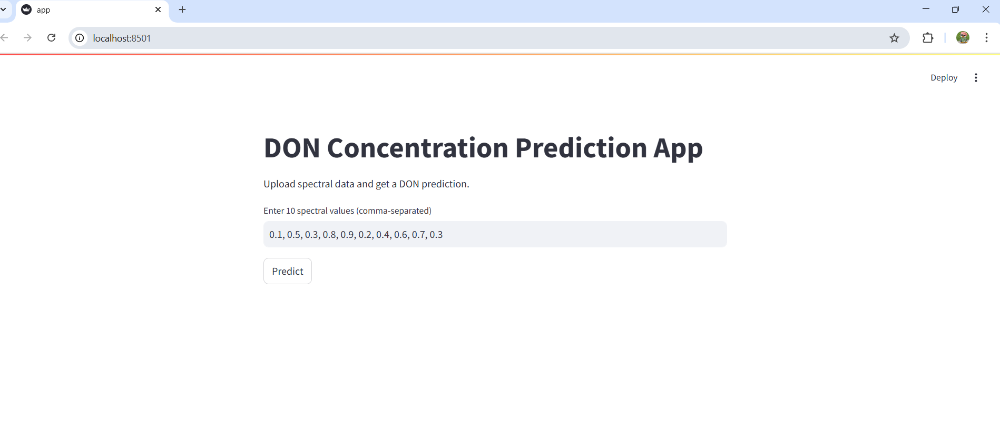

# 🌾 DON Concentration Prediction App

A machine learning-powered web application for predicting Deoxynivalenol (DON) concentration in agricultural products using spectral data. Built with Python, Streamlit, FastAPI, and Scikit-Learn, this project enables quick and accurate DON contamination predictions.

# 🚀 Features

✅ User-friendly Interface – Enter spectral values and get predictions instantly
✅ Machine Learning Model – Uses a trained MLP Regressor (Neural Network)
✅ Data Preprocessing – Handles missing values, normalizes spectral features
✅ Model Evaluation – Performance measured using MAE, RMSE, and R²
✅ Web Deployment – Available via Streamlit (UI) & FastAPI (API)

# 📂 Project Structure
├── mycotoxin_prediction.py  # Main ML pipeline: data processing, training, evaluation
├── app.py                   # FastAPI backend for model inference
├── don_prediction_model.pkl  # Trained model
├── scaler.pkl                # StandardScaler for input normalization
├── MLE-Assignment.csv        # Dataset
├── README.md                 # Project documentation

# 🛠️ Installation & Setup

# 1️⃣ Clone the Repository
  git clone https://github.com/your-username/don-prediction-app.git
  cd don-prediction-app

  # 2️⃣ Install Dependencies
      pip install -r requirements.txt

  # 3️⃣ Run the Streamlit App
     streamlit run mycotoxin_prediction.py
  
  # 4️⃣ Run the FastAPI Backend
    uvicorn app:app --reload

  # 📊 Model Performance
  Metric                      Score
Mean Absolute Error (MAE):    3342.7450
Root Mean Squared Error (RMSE):    9834.3624
R² Score:    0.6540  write this as a table

# 📢 API Usage

Once the FastAPI backend is running, send a POST request to:
http://localhost:8501/predict/

# Example Request (JSON)
{
  "features": [0.1, 0.5, 0.3, 0.8, 0.9,]
}

# Example Response
{
  "predicted_don_concentration": 3.45
}

# 🏗️ Future Improvements

🔍 Hyperparameter tuning for improved model accuracy
📈 Visualization dashboards for better insights
☁️ Cloud deployment on AWS/GCP

# 🖥️ Author
👩‍💻 Sudarshanam Yessasvini
📧 Email: your.yessasvini.s@gmail.com

# 🔗 Deployment URLs

Local URL: http://localhost:8501
Network URL: http://192.168.1.2:8501 (Change this according to your network configuration)

